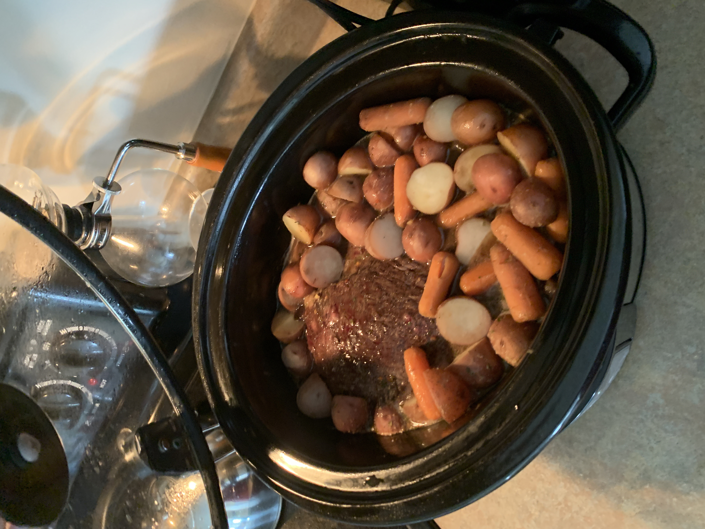

# Jeff's stupid easy pot roast

### Ingredients

*  3-ish pound chuck roast (look for good marbling)
*  1.25-1.5 cup water (I tend to lean towards 1.5. More gravy)
*  1 .7oz package of dry Italian salad dressing mix
*  1 1oz package of dry ranch dressing mix
*  1 ~.75oz packet of dry brown gravy mix (They range from .7 to .9 by brand, find one you like.)
*  Ground black pepper
*  2 dozen baby red potatoes
*  Half a bag of baby carrots (As many as you can hold in 2 hands. How's that for "exact measurement"?)
*  Half a head of a small cabbage. 

#### Preparation:

Mix the 3 packets in the water and whisk it until it's smooth.  

Halve the potatoes, or quarter if they're bigger than golf balls.  

Sprinkle the roast with black pepper, then sear all sides, corners, surfaces over medium-high heat. (I just dust the sides as I go. YMMV)  

Put the roast in an appropriately large crockpot. Add the potatoes and carrots, poking them down around the edges. Pour the liquid concoction over all of it.  

Cook on low for 6-8 hours.  

Chop up the cabbage into whatever size chunks you prefer, but smaller than "just a half head". (I like "shredded".)  

1-2 hours before the roast is done, add the cabbage and poke it down into the juices.  

When you can pull the roast apart with a fork, it's done. (It should be a multi-step process to get it out of the pot, because it just falls apart.)  

