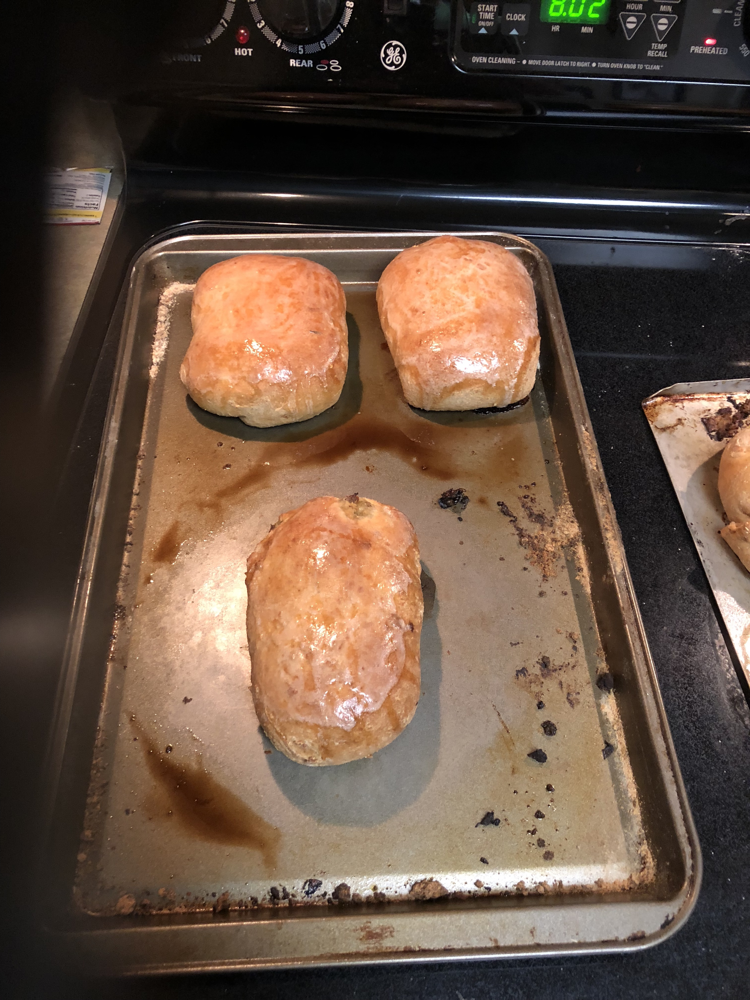

# Jeff's Nebraska Runzas (mostly)

### Ingredients
#### Bread
*  2 pkgs yeast
*  2.25 c. warm water
*  1/3 c. dry milk (Carnation, etc.)
*  1/3 c. sugar
*  2/3 c. vegetable oil
*  2 tsp. salt
*  6 c. wheat flour
*  1 egg

#### Filling
*  1.5-2 lb. ground beef (93/7)
*  1 yellow onion (minced)
*  1/2 - 1 head cabbage (half a large head, etc.)
*  1 tsp. salt
*  1 tsp. pepper
*  1 tsp. seasoned salt (Mrs. Dash, et al)
*  1 tsp. garlic powder
*  1 tsp. beef seasoning rub (JB's Fat Boy Angus Rub, etc.)
*  1 c. water

### Make the bread dough
Mix the dry ingredients and oil, then blend in the watter until you get a good dough consistency. Let sit for 45-90 minutes until it's risen to almost double in size.

### Make the filling
Start the meat and onions browning and add the seasonings. Stir frequently. When the beef is almost fully browned, add the cabbage and water. Cook until the cabbage is soft. Allow to cool.

### Make the sandwiches
Take racketball size chunks of dough and roll them out. Add filling until you can wrap the filling without ripping the dough. Pinch the dough together to seal, then place them seam side down on a greased cookie sheet. Leave an inch or two between rolls.

### Bake
Bake the rolls at 350 for 20-30 minutes. When the top starts to brown, they're done. When you remove the rolls, grease the tops with a stick of butter.

  
    
